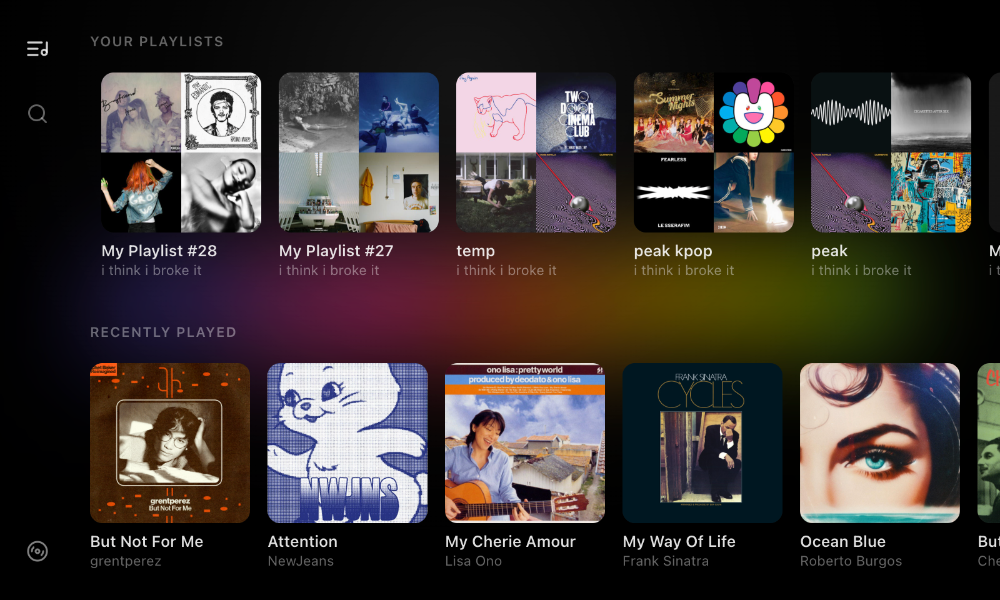
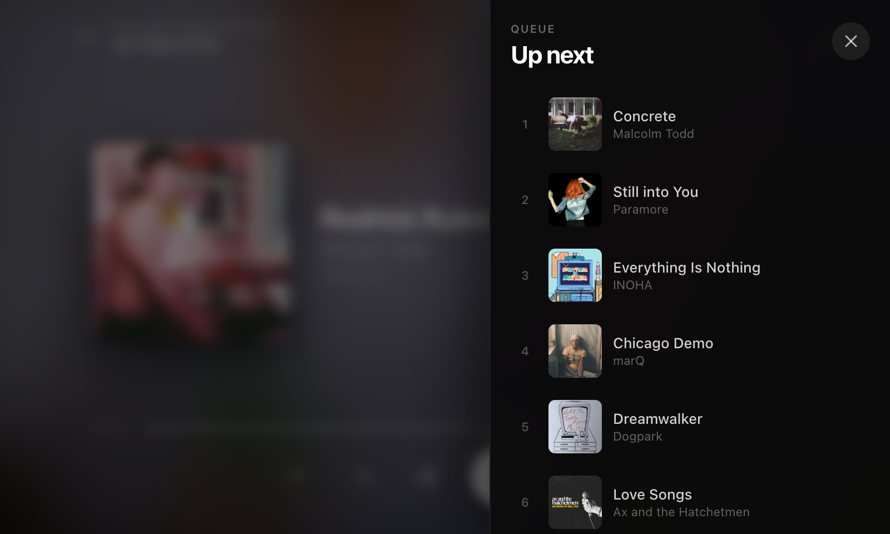

# Spotify Kiosk

A full-screen Spotify UI meant for a Raspberry Pi touchscreen, though you can run it on any computer with a display. It uses the Spotify Web API for library, search, playback, and queue through Spotify Connect.


<p align="center">
  
  
</p>

> [!WARNING]
> Built with AI. The server stores Spotify OAuth tokens and listens on localhost.

## What you need

- Node 20+
- A [Spotify Developer app](https://developer.spotify.com/dashboard) with a redirect URI
- A Spotify Connect speaker or receiver

## Run locally

Create a Spotify app and add:

```
http://127.0.0.1:4928/api/auth/callback
```

```sh
cp .env.example .env
# SPOTIFY_CLIENT_ID and SPOTIFY_CLIENT_SECRET

npm install
npm run dev
```

UI: http://127.0.0.1:5173 (Vite proxies API calls to port 4928).
Preview without Spotify credentials: `http://127.0.0.1:5173/?demo`

Production:

```sh
npm run build
npm start
```

## Install on a Raspberry Pi

```sh
git clone https://github.com/MostOriginalIGN/spotify-pi-kiosk.git
cd spotify-pi-kiosk
bash deploy/install-pi.sh
```

The installer asks where to put the app (default `/opt/spotify-kiosk`), then prompts for your sudo password when it needs root. It also walks through Spotify credentials, device name, and optional Raspotify setup.

After install:

1. Add the redirect URI the installer prints to your Spotify app.
2. Open the kiosk in Chromium and log in.
3. If `SPOTIFY_DEVICE_NAME` does not match what you see in the Spotify app, fix it in your install directory’s `.env` (default `/opt/spotify-kiosk/.env`).
4. Using Raspotify with token sync? Restart it after login: `sudo systemctl restart raspotify.service`

```sh
sudo systemctl restart spotify-kiosk.service
systemctl --user restart spotify-kiosk-browser.service
```

## Raspotify (optional)

If you use [Raspotify](https://github.com/dtcooper/raspotify) on the same Pi, the installer can optionally hook up:

- **Token sync** — writes your OAuth token to a file so the Pi shows up as a Connect device
- **Play events** — faster now-playing updates when playback starts from the Spotify app
- **ONEVENT** — optional `LIBRESPOT_ONEVENT` in `/etc/raspotify/conf`

## Config

See `.env.example`.

| Variable | Notes |
|----------|--------|
| `HOST` | Default `127.0.0.1` (local only) |
| `PORT` | Default `4928` |
| `SPOTIFY_DEVICE_NAME` | Defaults to hostname |
| `DEVICE_HINT_ENABLED` | `0` hides the “open Spotify on your phone” overlay |
| `DEVICE_HINT_INTERVAL_MS` | Default `300000` (5 min) |
| `SPOTIFY_SYNC_CONNECT_TOKEN` | Set to `1` for librespot/Raspotify token file sync |
| `SPOTIFY_CONNECT_TOKEN_PATH` | Where to write the token (Pi installer sets this when Raspotify is enabled) |

## License

MIT — see [LICENSE](LICENSE).
